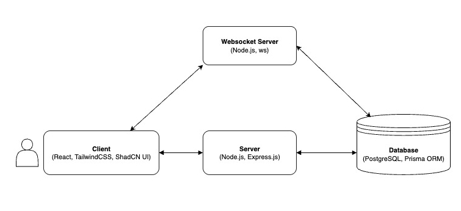

# Virtual Office Application (GatherTown Clone)

## Overview

Developed an interactive virtual collaboration platform inspired by Gather Town, enabling users to join shared spaces, select avatars, and engage in real-time movement and interactions.

## Key Highlights

- Architected a **Node.js backend with Express.js** to handle authentication (JWT), space creation, and user management APIs.
- Built a **WebSocket server (using ws)** to manage real-time state synchronization across users, including movement validation (collision detection, boundary checks) and broadcasting updates to all participants in a space.
- Implemented a **grid-based movement algorithm** on the server, ensuring accurate and conflict-free positioning by validating moves against the current state of other players and the map.
- Designed a scalable **client interface** using React, TypeScript, TailwindCSS, and ShadCN UI, ensuring seamless real-time interactions with low-latency event handling.
- Engineered a **future-ready architecture** to support WebRTC-based video/audio calls when users are near each other in the virtual space.

## Tech Stack

- **Frontend:** React, TypeScript, TailwindCSS, ShadCN UI
- **Backend:** Node.js, Express.js, JWT
- **Real-Time Communication:** WebSocket (ws)

## System Design

